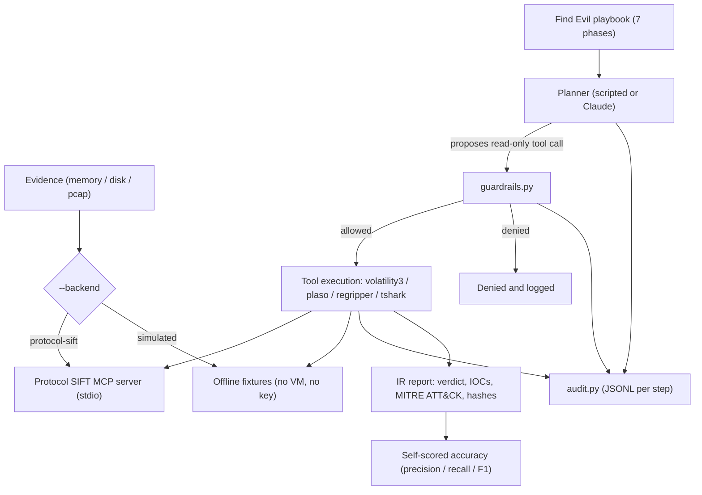

# sift-sentinel architecture

A guarded, auditable DFIR triage agent that drives Protocol SIFT through the SANS Find Evil methodology. The planner proposes; code-enforced guardrails decide; every step is logged.

## Flow

## Guardrails (code, not prompt)

`guardrails.py` is the enforcement point between the planner and the toolchain. Four checks:

1. **Read-only allowlist** - only vetted read-only forensic tools may run.
2. **Destructive deny list** - `dd`, `mkfs`, `rm`, `mount` and similar are refused outright; unknown tools default to denied.
3. **Path jail** - every path argument is resolved (after symlink and `~` expansion) and rejected if it falls outside the evidence and workspace roots.
4. **SHA-256 evidence ledger** - evidence hashes are re-verified after every tool call and once more as a final gate.

Deny reasons are a closed `Literal` union, so the audit log and tests stay exhaustive.

## Components

| Module | Responsibility |
|---|---|
| playbook | The 7-phase Find Evil methodology as data (one source of truth for both planners). |
| planner | Proposes the next read-only tool call (scripted default, or Claude). |
| `guardrails.py` | Allowlist, deny list, path jail, evidence ledger. |
| `run_sift_tool` | Single stable tool definition over MCP (keeps the prompt prefix byte-stable across turns). |
| `audit.py` | One flushed JSONL record per step (plan, tool_call, validation, revision, report, stop). |
| reporting | IR report + IOC table + MITRE ATT&CK mapping + self-scored accuracy report. |

The whole guarded loop runs offline (`--backend simulated`) with no API key and no VM; `--backend protocol-sift` points the same code at a live SIFT Workstation.
